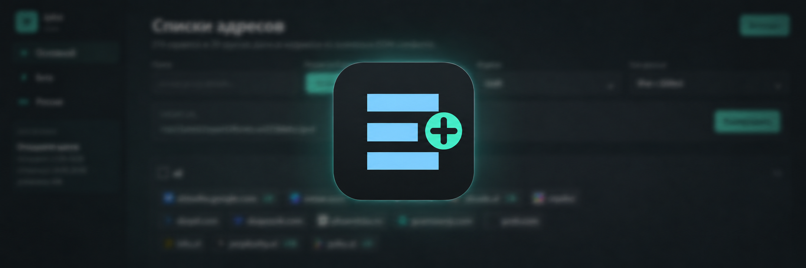

<p align="center">
  
</p>

[](https://github.com/dexogen/iplist-go/actions/workflows/test.yml)
[](https://github.com/dexogen/iplist-go/actions/workflows/build-image.yml)
[](https://github.com/dexogen/iplist-go/pkgs/container/iplist-go)

`iplist-go` - идейный форк [`rekryt/iplist`](https://github.com/rekryt/iplist) на своем backend и frontend. Go отдает API и embedded Svelte UI, без PHP/Nuxt runtime.

Конфиги не живут в этом репозитории. При сборке образ забирает `config/{master,beta,russia}` из [`dexogen/iplist-go-sidecar`](https://github.com/dexogen/iplist-go-sidecar), а иконки сервисов скачиваются и кладутся внутрь контейнера.

## Что внутри

- один контейнер держит три набора данных: `/`, `/beta`, `/russia`;
- API живет в `/api/latest/`, `/api/beta/`, `/api/russia/`;
- DNS-refresh работает внутри контейнера по cron и пишет добавления в `runtime/dns`;
- full exports кешируются в `runtime/export-cache`;
- форматы: `json`, `text`, `unifi`, `mikrotik`, `ipset`, `nfset`, `amnezia`.

## Запуск

```bash
cp .env.example .env
docker compose up -d --build
```

```text
http://127.0.0.1:8080/
http://127.0.0.1:8080/beta
http://127.0.0.1:8080/russia
```

## API

```text
GET /api/latest/
GET /api/latest/runtime
GET /api/latest/catalog
GET /api/latest/export?format=unifi&data=ipv4
GET /api/latest/favicon?site=chatgpt.com

GET /api/beta/
GET /api/beta/runtime
GET /api/beta/catalog
GET /api/beta/export?format=unifi&data=domains

GET /api/russia/
GET /api/russia/runtime
GET /api/russia/catalog
GET /api/russia/export?format=unifi&data=ipv4
```

Параметры экспорта:

- `format`: `json`, `text`, `unifi`, `mikrotik`, `ipset`, `nfset`, `amnezia`;
- `data`: `domains`, `ip4`, `ip6`, `cidr4`, `cidr6`, `ipv4`, `ipv6`;
- `site` и `group` можно передавать несколько раз;
- `exclude[site]`, `exclude[group]`, `exclude[domain]`, `exclude[ip4]`, `exclude[ip6]`, `exclude[cidr4]`, `exclude[cidr6]`.

`ipv4` означает `ip4 + cidr4`, где одиночные адреса становятся `/32`. `ipv6` так же объединяет `ip6 + cidr6`, одиночные адреса становятся `/128`.

## DNS-refresh

DNS-refresh не стартует от рестарта контейнера. Он ждет ближайшее время из cron:

```dotenv
IPLIST_DNS_REFRESH_ENABLED=true
IPLIST_DNS_REFRESH_CRON="0 */12 * * *"
IPLIST_DNS_REFRESH_TIMEZONE="UTC"
IPLIST_DNS_REFRESH_TIMEOUT="4s"
IPLIST_DNS_REFRESH_CONCURRENCY=8
IPLIST_DNS_RUNTIME_DIR="runtime/dns"
```

Runtime-файлы:

- `runtime/dns/<config-set>/<group>/<site>.json` - локально найденные IP;
- `runtime/dns/.status/<config-set>.json` - статус последнего прогона;
- `runtime/export-cache/<config-set>/...` - готовые full exports.

В `docker-compose.yml` runtime хранится в named volume `dns-runtime`.

## Разработка

```bash
go test ./...
cd web
npm ci
npm run build
```

Ручная сборка образа:

```bash
docker build -t iplist-go:local .
```
